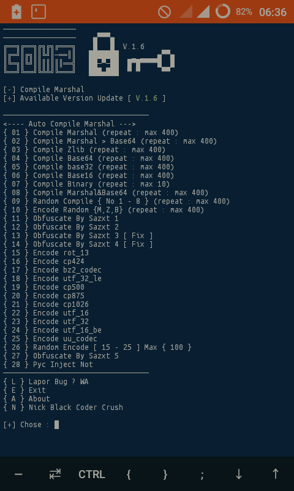
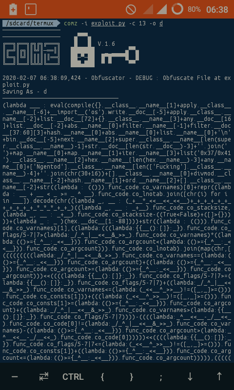

# Comz python2 Obfuscator

Only Obfuscator source code python2

How to install
-----
```
$ git clone https://github.com/Sazxt/comz
$ cd comz
$ pip2 install .
```

Usage
---
```
comz -m : show menu
comz -i file -c number.IS_compile -r Repeat -o outfile
comz --help : show help message
```

# Screenshots


# Tips
Usage Compile Functions
* `-c 1`, Compile Marshal (repeat : max 400)
* `-c 2`, Compile Marshal > Base64 (repeat : max 400)
* `-c 3`, Compile Zlib (repeat : max 400)
* `-c 4`, Compile Base64 (repeat : max 400)
* `-c 5`, Compile base32 (repeat : max 400)
* `-c 6`, Compile Base16 (repeat : max 400)
* `-c 7`, Compile Binary (repeat : max 10)
* `-c 8`, Compile Marshal&Base64 (repeat : max 400)
* `-c 9`, Random Compile { No 1 - 8 } (repeat : max 400)
* `-c 10`, Encode Random {M,Z,B} (repeat : max 400)
* `-c 11`, Obfuscate By Sazxt 1
* `-c 12`, Obfuscate By Sazxt 2
* `-c 13`, Obfuscate By Sazxt 3 [fix]
* `-c 14`, Obfuscate By Sazxt 4 [fix]
* `-c 15`, Encode rot_13
* `-c 16`, Encode cp424
* `-c 17`, Encode bz2_codec
* `-c 18`, Encode utf_32_le
* `-c 19`, Encode cp500
* `-c 20`, Encode cp875
* `-c 21`, Encode cp1026
* `-c 22`, Encode utf_32
* `-c 23`, Encode utf_16_be
* `-c 24`, Encode uu_codec
* `-c 25`, Random Encode [ 15 - 25 ] Max { 100 }
* `-c 26`, Obfuscate By Sazxt 5
* `-o `,  saving File
* `-r `, Repeat Count

# Links

* [Homepage](https://sazxt.herokuap.com)

	Thank you